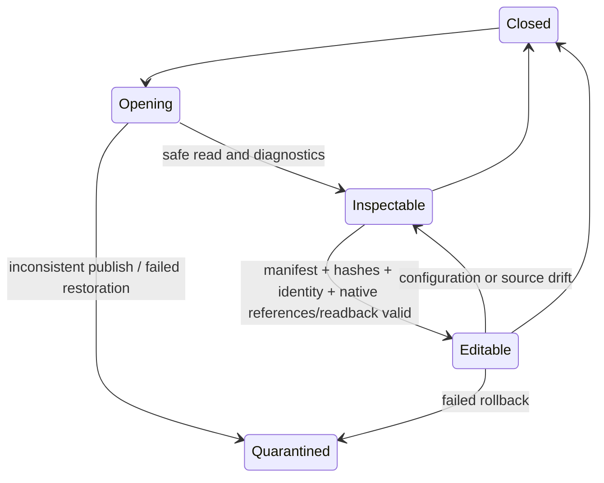
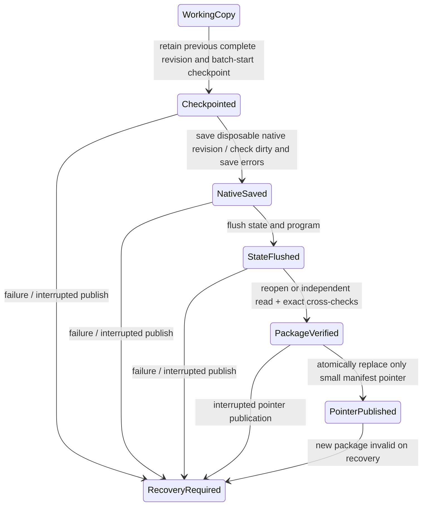

# Milestone 11: v0.3 Contract Freeze

PRD: `SWCAD_Harness_v0.3_PRD.md`, v0.3-draft-2, sections 5-17, M11 and 19-20. This milestone defines and tests contracts. It does not register native handlers, import a native Part, publish a migration, or implement milestones 12-20.

## Version And Wire Boundary

The existing `CadProgram`, `CadProgramJson`, `ProgramValidator`, `ProgramJsonSchema`, `OperationRegistry`, `CadState`, `StateValidation`, `AtomicStateStore`, Binder, relation engine, transaction coordinators, provider response schema and `RuntimeCapabilityCatalog` retain their v0.2 executable contracts. No existing enum, positive `ParameterNode` rule, parser limit, prompt, handler or provider setting is widened. M11 adds records under `CadHarness.Ir.V03` and `CadHarness.State.V03` and nonexecutable descriptors in Planning.

`ConstructionProgram` describes the generic-sketch extension vocabulary, not a replacement executable runtime. Its initial `create_extrude` consumes a bound generic sketch; it does not reinterpret the inline rectangle/circle v0.2 operation. Existing inline-profile operations remain v0.2. Integration of extension operations with the existing registry/handlers and the complete mixed construction plan is gated by M15-M17; existing hole/pattern/edge semantics must be reused there. The M11 extension reader and schemas are never supplied as executable provider schemas. A parsed extension is not execution approval.

The companion strategy avoids rewriting v0.2 files: an existing managed construction continues to refer to its exact v0.2 state/program artifacts, with a v0.3 companion and later revision manifest. Newly created extension artifacts carry explicit `0.3`; an external observation carries `origin=external` and no fabricated managed program. Native publication and editability require M12/M14 evidence.

Nine checked-in Draft 2020-12 field schemas are generated from the same record definitions as the strict reader. All fields are required, including nullable fields; null is explicit. Unknown, duplicate, missing, wrong-case, integer-enum and nonfinite fields reject. Tagged-union legality, identity, units, numeric bounds and ownership checks additionally run through `ContractValidation` / `ObservedStateValidation`. JSON Schema alone is not a CAD preflight or a native safety certificate.

The complete field/enum table is [v03-contract-fields.md](v03-contract-fields.md). It covers program, sketch, frame, requirement, response, scalar edit, EditSet, observation, provenance, manifest, migration and mutation result records.

## Limits And Units

| Contract | Frozen limit / rule |
|---|---|
| Construction JSON | 131072 UTF-8 bytes, depth 32, 1-12 operations; unchanged v0.2 maximum |
| State / companion JSON | 1048576 UTF-8 bytes, depth 32 |
| Semantic identifiers | 128 characters, lowercase safe dotted identifiers; no native API names or scripts |
| Length / radius / depth | `PositiveLength`, finite, greater than zero, at most 1000000 mm |
| Coordinates | `SignedCoordinate`, finite -1000000..1000000 mm, including zero |
| Plane offsets | Separate `SignedOffset`, finite same range; along local +Z |
| Angles | Finite degrees; revolution full=360 or finite strictly between 0 and 360; direction explicit |
| Frame | Origin in mm; unit orthonormal axes; X cross Y = Z; normal local +Z |
| Sketch | 1-64 entities, at most 128 named points, 1-8 loops, at most 64 constraints |
| Entity points | Line 2, arc 3, circle 1, polyline 3-64, slot 2 |
| Constraint references | 1-4 local point/entity identifiers; positive dimension for distance/radius/diameter |
| Requirements | 1-128 unique semantic keys; finite scalar with explicit mm/degree/count unit; confidence 0..1 |
| Clarification | 1-8 questions, each at most 512 characters; no program |
| Intent / explanation | Intent at most 4096 characters; evidence/support reason at most 2048 |
| Feature / geometry inventory | At most 256 features and 1024 geometry observations per model |
| Scalar / dependency inventory | At most 4096 measured parameters and 4096 native dependency edges |
| Evidence / remapping | 1-16 evidence facts per item; at most 256 explicit identity remappings |
| Native reference | Existing canonical base64 format; 1-8192 decoded bytes |
| EditSet | 2-16 edits, one document/configuration/revision, unique target/parameter pair |
| Pattern count candidate | Integral 2-256; one already active native direction |
| Fingerprint | Absolute `.SLDPRT` path, lowercase 64-digit SHA256, positive byte size |
| Oracle tolerances | Linear 0.01 mm, angular 0.01 degrees, relative volume 0.00001 |

Array bounds and primitive length/coordinate bounds appear in generated schemas; cross-record and aggregate limits are checked by the validators. No operation-limit increase is made without measured acceptance needs and matching parser/provider/backend changes.

## Geometry Semantics

Operation names are frozen: `create_sketch`, `create_datum_plane`, generic-sketch `create_extrude`, `create_revolved_boss`, `create_additive_boss`, `create_extruded_cut`. Each operation has a safe operation ID and feature semantic ID. Optional union fields must be null outside their owning operation. References bind prior typed outputs or `world.xy/xz/yz` and world principal axes; feature/output name collisions reject. A sketch exports `.profile` and its in-plane `.axis_x`; a datum exports `.plane`; each solid feature exports `.body`. These are proposed semantic outputs, not promises that native capture has already been implemented.

`create_sketch` requires placement and `ClosedSketch`. `create_datum_plane` requires placement and signed offset. A planar-face frame additionally needs a bound in-plane edge/axis. A reference plane has a verified frame. The backend must independently check plane normal, axis orientation, local-to-world transform and persistent ownership; the provider's frame/status declaration is not that proof.

Line points are ordered start/end. Arc points are ordered center/start/end with positive radius and nonzero signed sweep less than 360 degrees in magnitude; positive is counterclockwise about local +Z. Circle has one center and radius. Polyline points are ordered and implicitly closed. Slot points are ordered end-arc centers; width is diameter, length is the total capsule length, and center distance must equal length minus width. Loops enumerate entity traversal order; outer winding is counterclockwise, inner clockwise, and each entity belongs to exactly one loop. Internal entities/points/loops/constraints have distinct stable local IDs.

M11 validates tagged fields, references, declared constraint state and bounds. M15 must independently verify actual closure, endpoint agreement, arc sweep, winding, area, containment, nonintersection, constraint satisfaction and native solver agreement. A declaration of `fully_constrained` cannot bypass those checks. Unsupported arbitrary splines/equations are absent from the vocabulary.

Initial generic extrusion requires blind positive depth and `new_single_body`. Revolution requires its sketch's in-plane axis, full or finite angle, and `new_single_body`; crossing the axis, thin or multiple-body cases must be rejected by M15/M16 geometry/native preflight. Additive boss requires a previously tracked body, positive blind depth and `merge_with_host`. Cut requires a tracked host, direction and `remove_from_host`; blind requires positive depth, through-all requires null depth. Rebuild alone does not establish body count or material change. M16 must capture radial/axial/depth dimensions, independent volume/body evidence and complete sketch/datum/feature rollback.

## Requirements And Modes

Each requirement records `semanticKey`, value/unit, `given/derived_by_rule/defaulted/unresolved`, rule ID/version, confidence, ambiguity and criticality. Unresolved values are null; given facts cannot carry fabricated rule provenance. The initial contract conservatively restricts rule-filled/defaulted values to noncritical choices. Critical unknown/ambiguous facts block `planned`. `AcceptedRequirements` freezes validated serialized bytes and SHA256 for a plan/revision, so subsequent mutation of the caller's list cannot change the accepted record.

`planned` requires a typed program bound to the requirement record and no questions/reason. `needs_clarification` has questions and no program. `unsupported` has a reason and no program. Provider failure remains an error outside these semantic outcomes. Answers create a new record/plan; they cannot patch an approved record. Rule implementation and real provider composition are M17 work.

Creation, managed scalar edit, external scalar edit and EditSet use distinct `RequestMode` values. Single edit has its own envelope; a one-edit batch cannot masquerade as an EditSet. All edit envelopes carry exact document/configuration identity, expected revision, original and distinct working-copy fingerprints, target, finite parameter key/unit and expected old/new values. Actual current-value drift and aggregate ordering/final-state legality are future preflight duties. M11 executable guards reject even structurally valid extensions with `CAPABILITY_UNAVAILABLE`.

## Observed Model

Inventory is a versioned external overlay, not `FeatureNode` with a guessed `OperationKind`. Each node retains origin, display name/tree ordinal (diagnostic only), native type/subtype, health, optional verified reference, dependency completeness, edit-support reason, evidence, scalars/accessors and body/face/axis geometry. Missing reference/dependency evidence remains `unknown`; empty dependencies do not imply complete observation. Native dependencies and explicit design relations stay separate.

`unrecognized` nodes can remain read-only/unsupported with no persistent reference. Editable candidate descriptors require healthy reference, complete dependency evidence, measured candidate parameters and complete inventory; they still confer no runtime execution permission in M11. Overflow returns `OBSERVATION_LIMIT_EXCEEDED` with partial noneditable inventory. Unknown affected downstream behavior blocks mutation during M14 qualification.

`ObservedIdentity.FromReference` defines a stable SHA256-based ID from verified document/configuration lineage and canonical persistent-reference bytes, independent of display name and ordinal. M13 must establish that lineage without writing the original; unchanged file/configuration observations must agree. Missing persistent references receive observation-local read-only identities with explicit remapping when necessary. `IdentityRemapping` preserves prior/current IDs and verified evidence; it never silently authorizes rebinding by nearest geometry.

## Migration Matrix

| Input | M11 reader / resulting contract | Mutation status |
|---|---|---|
| Strict v0.2 state plus matching v0.2 program | Original records retained; ownership inventory cross-check; exact before/after hashes; v0.3 companion proposal with old/new versions and rollback path | Inspectable; `NATIVE_VALIDATION_REQUIRED`; not migrated/editable |
| v0.2 unsigned positive scalar | Same `ParameterNode`/binding type and positivity rule | Unchanged |
| v0.3 signed coordinate/offset | Separate types only; never converted into negative/zero legacy lengths | Contract-only |
| v0.1, unknown/duplicate/missing legacy fields | Existing strict reader rejects, surfaced as `MIGRATION_FAILED` | Blocked |
| Mismatched state/program feature ownership | `MIGRATION_FAILED`; original bytes untouched | Blocked |
| Source drift during read | `SOURCE_FILE_DRIFT`; no writes | Blocked |
| Missing state/program or unreadable artifact | Typed migration failure; no guessed reconstruction | Blocked |
| External native observation | Separate external overlay; no v0.2 program reinterpretation | Read-only until M14 qualification |
| Native hashes/references/configuration not verified | No durable manifest publication or editable transition | Inspectable or quarantined under M12 |

`LegacyMigrationReader` returns original typed data and a proposal; it never calls COM, writes an input, copies/converts a state file or publishes a revision. Successful pure parsing is not native migration completion. M12 must operate on a working copy and prove cold reopen, scalar/relation/geometry readback and rollback before publishing a migration result.

## Native Candidate Matrix

The machine-readable source of this matrix is `NativeQualificationCandidates.Rows`. All four rows have `Qualified=false`. API feasibility comes from the existing compiled v0.2 accessors and independently checked interop type signatures, not a new COM run. That establishes accessor availability only. No external history is advertised executable.

| Candidate subtype | Parameter / accessor | Native read / write | Mandatory independent checks |
|---|---|---|---|
| `straight_blind_boss_extrude` | `extrusion_depth` / `extrude_depth_direction1` | `IExtrudeFeatureData2.GetDepth(true)`; `AccessSelections`, `SetDepth`, `ModifyDefinition` | One blind direction, no draft/thin/offset/second direction or overriding driver; depth + axial geometry + downstream health |
| `single_circle_through_all_cut` | `hole_diameter` / `single_circle_radius` | Unique owning `ISketchArc.GetRadius/SetRadius`; definition through-all | One profile circle/cylindrical wall; both through boundaries, diameter/axis/volume; no Hole Wizard or linked/table/equation/configuration driver |
| `single_direction_linear_pattern` | `pattern_count` / `linear_pattern_direction1_count` | `ILinearPatternFeatureData.D1TotalInstances`; selection-preserving `ModifyDefinition` | Known seed/axis; active D1 only; no skipped/varying/body instances; centers/count and seed unchanged |
| Same single-direction pattern | `pattern_spacing` / `linear_pattern_direction1_spacing` | `D1Spacing` in meters; selection-preserving `ModifyDefinition` | Active D1 only; independent centers/clearance, downstream health and unchanged seed |

Up-to-surface and other extrusion variants, Hole Wizard, two-direction rectangular patterns, suppressed/deleted references and unsupported history combinations stay inspectable/read-only. Geometry equivalence never qualifies a second history. Equations, design tables, linked dimensions, configuration overrides or unknown relations with potential overwrite withhold edit capability. M14 needs positive edit + cold reopen + unsupported/ambiguous negative evidence for every advertised row.

## Publish And Reopen Design

The manifest records native bytes/hash, state/program artifacts and schema versions, document/configuration identity, revision and previous manifest hash. Managed packages require a program; external ones must not invent one. This is a single-Part durability protocol, not an atomic transaction across CAD and JSON files. The following diagrams are frozen design contracts, not implemented controllers.

Before pointer publication, previous complete revision remains authoritative. After publication, verify the new package before enabling edits. If neither candidate is provable, preserve recovery evidence and quarantine. Keep the previous revision until the next has been verified. Save As and configuration switching require explicit identity transitions; unsupported transitions preserve prior files and refuse.

`MutationReport` freezes source/working identity, expected/current revision, exact target IDs, native-start flag, nullable rebuild result, rollback attempted/succeeded, native/state publication, editability and typed failure. A state-only commit cannot claim success. Success requires both verified publications and one revision. Failed rollback makes the session noneditable.

## Acceptance Freeze

`tests/CadHarness.V03Contracts.Tests/Fixtures/acceptance-tasks.json` freezes numeric C1-C4 tasks, primary variables, dependent relations, follow-up edits, analytical independent volume/geometry oracles, tolerances, held-out task definitions and critical-unknown refusals. Held-out definitions are test-only and excluded from production prompts/handlers; separate file/subset hashes are retained in the contract freeze. The runner's source scan checks absence of C1-C6 fixture dispatch in production.

C1 freezes three shaft regions plus annular groove and middle radius edit; C2 freezes coaxial sleeve/flange/stepped bore and bore-radius edit; C3 freezes perpendicular merged bracket, holes and cosmetic fillet default, with additive-depth edit; C4 freezes three independent blind capsule-slot cuts and one cut-depth edit. C4's end radius is explicitly derived from width. C3/C4 provide two disclosed noncritical rule/default traces. Independent measurement uses native surfaces, driving dimensions, untouched geometry, body/volume checks and cold reopen, not displayed feature names or screenshots.

The external held-out specification requires independently authored circular-cut and Hole Wizard histories, renamed features, unrelated unsupported inventory and an affected unsupported descendant negative case. No `.SLDPRT` fixture is fabricated or claimed present in M11; actual fixture authoring/version/configuration/checksums must be recorded before M13 intake. Runtime capability restrictions must be resolved by qualification in later milestones, never by weakening these frozen tasks after a failed measured run.

Tool expansion: existing executable construction still has one structured plan response and one bounded execution approval; provider callable native tools remain zero. Existing registry alternatives remain 9. Six extension descriptors and nine field schemas are contract-only; executable provider alternatives added=0. The public external-edit/batch guards reject all M11 candidates. P1 C5/C6, query/preview, relation query and Playground controls remain deferred.
